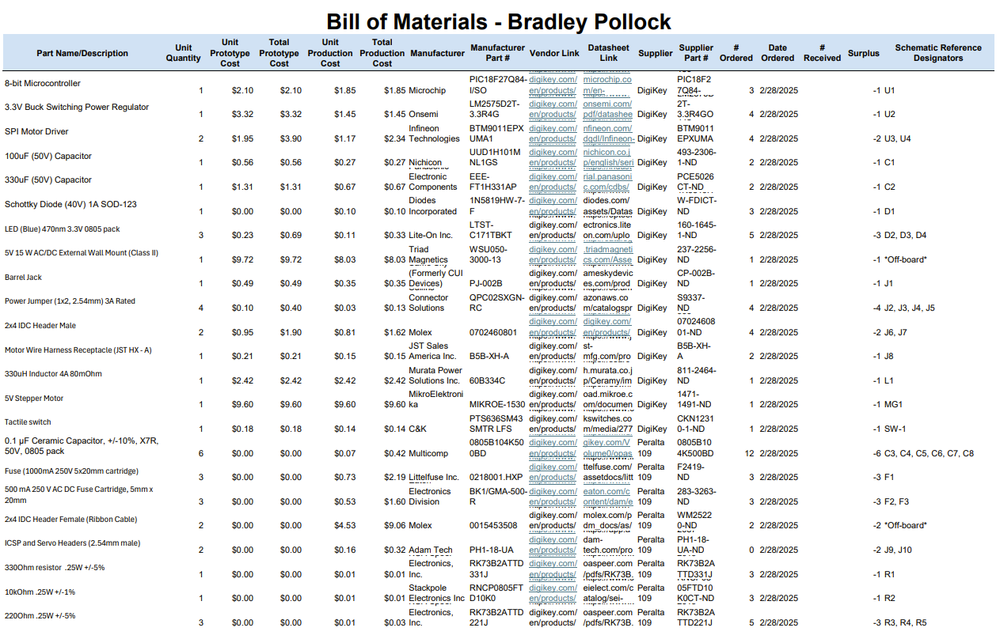

## Bill of Materials

The following table depicts each and every part currently needed for the design of the stepper motor subsystem. One may take note of a number of irregularities: some parts are listed as being ordered in surplus, some are listed as having not been ordered at all, and none have a listed date of receipt. Each of these items are completely intentional. The items ordered in surplus are the most at risk of failure or are the most critical to device function, while the items ommitted from orders (see *Order Form* below) are available for use in the Peralta Labs at the Arizona State University Polytechnic Campus.

**Table 1: Bill of Materials** 

*The above table is available* [here](Bill-of-Materials_BPollock_sorted.xlsb.xlsx).

# Purchase Order

The following file is the purchase order sent to professor Dan Aukes on the 28th of February, 2025. Parts were exclusively ordered from DigiKey.

*Download available* [here](BPollock_Purchase_Request_DigiKey.xlsx)

