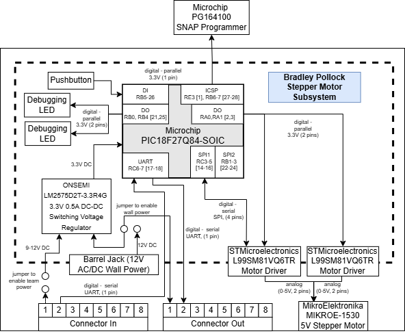
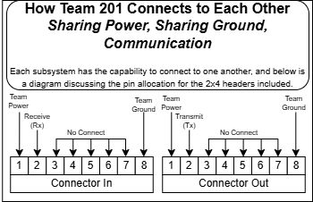

The image below displays a system-level block diagram for the stepper motor subsystem of the Element Sorter.

Address any feedback received, whether in person or in writing.
### Feedback Received
Following an external design review, many suggestions were made, with their corresponding changes reflected in the block diagram. One major issue was shared team communication and power. As a result, jumpers are now shown to demonstrate the dual capability of the stepper motor subsytem to utilize either isolated power supplied by an AC/DC wall jack or to instead tap into shared team power. Another peice of feedback received was a request for specific manufacturer and part number information for all peripherals used. This has now been updated.

In order to shed additional light on Team 201's board-to-board connection protocol, the following image was developed. Note that each team member agreed to follow this protocol, allowing greater collaboration and easier debugging. 

 
The diagram was developed over time in tandem with the [component selection](https://bradpollock.github.io/Component-Selection/Component-Selection-Process/), as each peripheral and its relation to the PIC18 chip used changed the overall layout of the diagram. The block diagram also serves to demonstrate how the future-developed [PCB design](https://bradpollock.github.io/Schematic-Design/Schematic-Design/) would function. One example of this is the demonstration of two SPI motor drivers, powered by both the higher-voltage and the 3.3 volt power sent from the surface-mount regulator. The diagram also documents the use of in-circuit serial programming (ICSP), which was discovered to be incredibly useful in the programming and debugging of the [PCB design](https://bradpollock.github.io/Schematic-Design/Schematic-Design/).

SVG Available [here](static/media/FullBlockDiagram.drawio.svg) PDF available [here](static/media/FullBlockDiagram.pdf)
