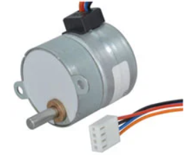

## **Introduction**

As defined by team 201, the purpose of this subsystem is to accurately and reliably manipulate a set of linear tracks in order to quickly and consistently sort colored spheres. It has been determined that this subsystem will thus focus on the implementation of an SPI-controlled stepper motor to manipulate the sorting mechanism. To satisfy these needs, both a *stepper motor* and a *stepper motor driver* have been benchmarked and researched (see Tables 2, 3 below). The power budget for the project is featured at the end of the page.

>The following page documents and contains both *Major Component Benchmarking* and *Microcontroller Selection* tasks.

## **Major Component Final Selections**

Below is featured the final selection of stepper motor and motor driver. While the subsystem was not fully functional at the May 2 innovation showcase, there was a good deal learned in the development of the system. One major flaw in the system that has yet to be diagnosed is the sudden and irreversable device-crippling short discovered when the chosen motor driver is tested from two adjacent leads (namely VS and Output 1, see [*product datasheet*](Infineon-IFX9201SG-DS-v01_01.pdf)). The majority of feedback related to this portion of the assigment was related to the selection of the final motor driver, this being a result of a difficult search for a driver that met the unique requirements of this project (hand soldering).

### **Table 1: Final Component Selection**

| **Stepper Motor** | **Pros/Cons** |
|---|---|
| **Stepper Motor**: Fuller Motors 35BYHJ30-36A 12V Stepper Motor  **Cost: $2.95/unit** [Jameco](https://www.jameco.com/z/35BYHJ30-36A-Fulling-Motor-USA-Bipolar-Stepper-Motor-12VDC-259-mA-7-5-deg-48-Steps_2234476.html?CID=GOOG&gad_source=1&gclid=CjwKCAiAlPu9BhAjEiwA5NDSA3S3xKQSO3o9rV3IAYmnlmhb64g-l5FYRvc8DqAq_hisXs7W4HKWGxoCDoUQAvD_BwE) - [*Datasheet*](2234476.pdf)| **Reasons for selection:**  - Extremely Cost effective   - Convenient mounting profile  **Cons:**  - Simplistic Datasheet   - Large step size   - Higher voltage requirements|
| **Motor Driver**: Infineon IFX9201SG  **Cost: $1.95/unit** [DigiKey](https://www.digikey.com/en/products/detail/infineon-technologies/IFX9201SGAUMA1/5415542?s=N4IgTCBcDaIJIDEAaBOMAGAjAZQOIgF0BfIA) - [*Datasheet*](Infineon-IFX9201SG-DS-v01_01.pdf) | **Reasons for selection:**  - Simple H-bridge layout   - Extremely cost effective   - Small pin count  - Previously used- already developed  **Cons:**  - Requires multiple units to drive a stepper motor   - Device not specifically designed for stepper motor control|

## **Major Component Benchmarking**

Products in this category were selected based on usability and the perceivable ease which they will be integrated on a surface-mount PCB. The following devices were researched: **Stepper motors** and **Stepper motor drivers**.

### **Table 2: Stepper Motors**

| **Stepper Motor** | **Pros/Cons** |
|---|---|
| **Device 1**: MikroElektronika MIKROE-1530 5V stepper motor   **Cost: $9.60/unit** [DigiKey](https://www.digikey.com/en/products/detail/mikroelektronika/MIKROE-1530/5724295) - [*Datasheet*](https://download.mikroe.com/documents/datasheets/step-motor-5v-28byj48-datasheet.pdf) | **Pros:**  - Extremely common and well-documented by oustide sources   - Very fine resolution  **Cons:**  - Simplistic datasheet  - Wire come pre-connected to header (extra header or electric work needed to integrate).|
| **Device 2**: Pololu 1207 Bipolar stepper motor   **Cost: $19.40/unit**  [DigiKey](https://www.digikey.com/en/products/detail/pololu/1207/10449950) - [*Datasheet*](https://www.pololu.com/product-info-merged/1207) | **Pros:**  - Higher voltage motor   - Easy mounting profile   **Cons:**  - Datasheet does not contain safety information (absolute maximum ratings)  - Higher price point|
| **Device 3**: Pololu 1209  **Cost: $22.75/unit** [DigiKey](https://www.digikey.com/en/products/detail/pololu/1209/10449952) - [*Datasheet*](https://www.pololu.com/product-info-merged/1209) | **Pros:**  - Higher running current takes advantage of barrel power supply (provides higher holding torque)   - Convenient mounting profile  **Cons:**  - Similar datasheet issues to the Pololu 1207   - Lower rated voltage|
| **Device 4**: Fuller Motors 35BYHJ30-36A 12V Stepper Motor  **Cost: $2.95/unit** [Jameco](https://www.jameco.com/z/35BYHJ30-36A-Fulling-Motor-USA-Bipolar-Stepper-Motor-12VDC-259-mA-7-5-deg-48-Steps_2234476.html?CID=GOOG&gad_source=1&gclid=CjwKCAiAlPu9BhAjEiwA5NDSA3S3xKQSO3o9rV3IAYmnlmhb64g-l5FYRvc8DqAq_hisXs7W4HKWGxoCDoUQAvD_BwE) - [*Datasheet*](2234476.pdf)| **Pros:**  - Extremely Cost effective   - Convenient mounting profile  **Cons:**  - Simplistic Datasheet   - Large step size   - Higher voltage requirements|

***Original Stepper motor decision:** Product #1: Fuller Motors 35BYHJ30-36A 12V Stepper Motor*
This decision was made due to the reliability, low price point, and ubiquitous nature of this stepper motor.

>***Final Stepper motor decision:** Product #4: MikroElektronika MIKROE-1530 5V stepper motor*  This final decision was made due to the cost effective nature and simple mounting profile of the motor. In addition, controlling the device is made simple in terms of wiring and programming by nature of the four-wire setup. This change was made as various requirements of stepper motor drivers were considered. Another major reason for this change was the availablity and previous use of this driver in class-based labs.

### **Table 3: Stepper Motor Drivers**

| **Stepper Motor Driver** | **Pros/Cons** |
|---|---|
| **Device 1**: Onsemi NCV7708FDWR2G Double Hex Driver   **Cost: $5.83/unit** [DigiKey](https://www.digikey.com/en/products/detail/onsemi/NCV7708FDWR2G/9829237) - [*Datasheet*](https://www.onsemi.com/pdf/datasheet/ncv7708f-d.pdf)   | **Pros:**  - Larger SOIC package size (easier assembly)   - Clear SPI datasheet  **Cons:**  - Large pin count (several unused pins)  - No express stepper motor drive functions (the device is not expressly designed for stepper motors).|
| **Device 2**: Analog Devices Inc./Maxim Integrated TMC249A-SA  **Cost: $16.64/unit** [DigiKey](https://www.digikey.com/en/products/detail/analog-devices-inc-maxim-integrated/TMC249A-SA/4399665) - [*Datasheet*](https://www.analog.com/media/en/technical-documentation/data-sheets/TMC249_datasheet_rev2.22.pdf) | **Pros:**  - Explicit and easy-to-read datasheet   - Serial control is a major design influence   **Cons:**  - High Unit Price (over 1/6 of budget)  - Large pin count (increases assembly time)|
| **Device 3**: Infineon IFX9201SG ! **Cost: $1.95/unit** [DigiKey](https://www.digikey.com/en/products/detail/infineon-technologies/IFX9201SGAUMA1/5415542?s=N4IgTCBcDaIJIDEAaBOMAGAjAZQOIgF0BfIA) - [*Datasheet*](Infineon-IFX9201SG-DS-v01_01.pdf) | **Pros:**  - Simple H-bridge layout   - Extremely cost effective   - Small pin count  **Cons:**  - Requires multiple units to drive a stepper motor   - Device not specifically designed for stepper motor control|

***Stepper motor driver decision:** Device 3: Infineon IFX9201SG*
This device, though requiring multiple chips for full functionality, is more straightforward to implement. The low price point also allows the purchase of several extra units in case of design failure.

## **Microcontroller Selection**

Microcontrollers were researched based on given product requirements, such as a need for at least one SPI output and one UART RX/TX pair for communication with peripheral ICs and other controllers on the team daisy chain. See the table below for further details.

### **Table 4: PIC Info Table**

| **PIC Info** | **Answer** |
| --- | --- |
| Model | PIC18F27Q84 |
| Product Page URL | [Microchip](https://www.microchip.com/en-us/product/pic18f27q84) |
| Datasheet URL(s) | [Microchip](https://ww1.microchip.com/downloads/aemDocuments/documents/MCU08/ProductDocuments/DataSheets/PIC18F27-47-57Q84-Microcontroller-Data-Sheet-DS40002213.pdf) |
| Application Notes URL(s)| [Microchip](https://www.microchip.com/en-us/product/pic18f27q84#:~:text=Collapse-,Documentation,-Documents) |
| Vendor link | [DigiKey](https://www.digikey.com/en/products/detail/microchip-technology/PIC18F27Q84-I-SO/12807406) |
| Code Examples  | [Microchip](https://www.microchip.com/en-us/product/pic18f27q84#Design%20Resources:~:text=MPLAB%20Xpress%20IDE.-,Design%20Resources,-Code%20Examples) - [Github Collection](https://github.com/microchip-pic-avr-examples) - [CNC Example](https://github.com/microchip-pic-avr-examples/pic18f57q84-2-axis-cnc) |
| External Resources URL(s) | [YouTube.com](https://www.youtube.com/watch?v=8aYCZFFJLXI) - [Microchip (Example utilizes separate devBoard but appears useful)](https://www.microchip.com/en-us/about/media-center/videos/MfKy9SII6gM) |
| Unit cost | $2.10 |
| IC Absolute Maximum Current | **Vss Pin:** 350mA  **Vdd Pin:** 250mA  **I/O Pins:** 50mA |
| Supply Voltage Range | 1.8V <= *VDD* <= 5.5V |
| Maximum GPIO current | 50mA (See Above) |
| Supports External Interrupts | 3 Pins |
| Required Programming Info Hardware, Cost, URL| Device supports In-circuit Serial Programming (ICSP) with the use of 5 pins (ICSPCLK, ICSPDAT, MCLR/Vpp, Vdd, and Vss). An ICSP programmer such as the [MPLAB SNAP](https://www.microchip.com/en-us/development-tool/pg164100) would be necessary to use this function. (*Requires use of MPLAB X IDE*) |
| Works with MPLabX? | Yes, see [Microchip Site](https://www.microchip.com/en-us/product/pic18f27q84#Design%20Resources:~:text=T%C3%9CV%20S%C3%9CD%20certified-,MPLABX,-development%20tools%20are) |
| Works with Microchip Code Configurator? | Yes, see MPLAB X Screenshot |

### **Table 5: PIC Peripherals Data**

| Module | # Available | Needed | Associated Pins (or * for any) |
| ---------- | ----------- | ------ | ------------------------------ |
| GPIO | 25 | 4+ | * |
| ADC | 24 | 0 | * |
| UART | 5 | 1 | *CTS/RX:* RA4-7, RB4-7, RC6-7, *DTR, RTS, TX:* *(any) |
| SPI | 2 | 1 | *CS, SCK, SDO:* *(any), *SDI,SCK:* RB2-3, RC3-4, *SS:* RA4-5 |
| I2C | 1 | 0 | *Logic:* RB1-2, *SCL,SDA:* RC3-4, *(Any) |
| PWM (Standalone) | 4 | 0 | *CCP:* RB*, *PWMERS, PWMIN, CCP:* RC*, *PWM1/2/3:* *(any)|
| ICSP | Yes (3 pins) | 3 | *MCLR:* RE3, *ICSPDAT:* RB7, *ICSPCLK:* RB6 |

###**Figure 1:** Final MPLAB X Screenshot featuring possible peripherals and pin layout

Note that only one SPI module is used- Pins RA0, RC3, RC4, and RC5 were used (see above screenshot) as the chip select, clock, serial input, and serial output lines, respectively. An additional pin, RA4, was used as a second chip select pin to control the second motor driver. Both drivers received data and clock signals from ports RC3 and RC5, respectively.

>No major feedback was received in relation to the SPI subsystem, though use of previous class assignments was invaluable.

### *Microcontroller Rationale*

The Microchip PIC18F27Q84 comes from a line of tried and true microcontrollers used in a variety of application. Though marketed as "recommended for automotive applications", the device explicitly supports the perfect amount of functionality for the applications listed in the introduction to this page. The presence of an extra SPI module brings peace of mind in the event that it becomes difficult to control multiple motor drivers from the same SPI line. Additionally, the device currently boasts at least ten additional I/O pins that can be used to enable a variety of "bonus" functions, such as debugging LED indicators, extra motor drivers, or sphere-indexing servo motors. The low price point is another excellent feature of the PIC18F27Q84, lending itself well to a healthy, mistake-friendly development process.

## **Power Budget**
Below is the power budget used to determine necessary supply voltages for the project. A PDF download is available [*here*](PowerBudget.pdf), and a Microsoft Excel Sheet [*here*](PowerBudget.xlsx).

>Updates made: Changes made to the power budget were mostly clerical in nature (increasing resolution and replacing part numbers and values from various components changed as the project took its final form). One major change to note is an increase of the overall supply voltage from +5 volts DC to +12 V DC. This was done for two main reasons: project requirements dictate a supply within the 9-12V range, and the final motor selected requires 12 volts. In choosing minor components, an inductor used to service a 3.3V switching regulator was chosen based on a necessity of at least 3 amps of current. Further changes and research shows that this was unnecessary, but the choice has yet to prove problematic. An oscilloscope reading of the +3.3V line appears clean and safe.

