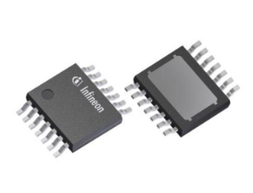

## Selection Process

Products were selected based on usability and the perceivable ease which they will be integrated on a surface-mount PCB.

The following devices were researched: **Stepper motors** and **Stepper motor drivers**.

## Stepper Motors

| **Stepper Motor** | **Pros/Cons** |
|---|---|
| **Device 1**: MikroElektronika MIKROE-1530 5V tepper motor   [DigiKey](https://www.digikey.com/en/products/detail/mikroelektronika/MIKROE-1530/5724295) [*Datasheet*](https://download.mikroe.com/documents/datasheets/step-motor-5v-28byj48-datasheet.pdf) **Cost: $9.60/unit**  | **Pros:**  - Extremely common and well-documented by oustide sources   - Very fine resolution  **Cons:**  - Simplistic datasheet  - Wire come pre-connected to header (extra header or electric work needed to integrate).|
| **Device 2**: Pololu 1207 Bipolar stepper motor  [DigiKey](https://www.digikey.com/en/products/detail/pololu/1207/10449950) [*Datasheet*](https://www.pololu.com/product-info-merged/1207) **Cost: $19.40/unit**   | **Pros:**  - Higher voltage motor   - Easy mounting profile   **Cons:**  - Datasheet does not contain safety information (absolute maximum ratings)  - Higher price point|
| **Device 3**: Pololu 1209  [DigiKey](https://www.digikey.com/en/products/detail/pololu/1209/10449952) [*Datasheet*](https://www.pololu.com/product-info-merged/1209) **Cost: $22.75/unit**   | **Pros:**  - Higher running current takes advantage of barrel power supply (provides higher holding torque)   - Convenient mounting profile  **Cons:**  - Similar datasheet issues to the Pololu 1207   - Lower rated voltage|

### Decision: Product #1: MikroElektronika MIKROE-1530 5V tepper motor
This decision was made due to the reliability, low price point, and ubiquitous nature of this stepper motor.

## Stepper Motor Drivers

| **Stepper Motor Driver** | **Pros/Cons** |
|---|---|
| **Device 1**: Onsemi NCV7708FDWR2G Double Hex Driver   [DigiKey](https://www.digikey.com/en/products/detail/onsemi/NCV7708FDWR2G/9829237) [*Datasheet*](https://www.onsemi.com/pdf/datasheet/ncv7708f-d.pdf) **Cost: $5.83/unit**  | **Pros:**  - Larger SOIC package size (easier assembly)   - Clear SPI datasheet  **Cons:**  - Large pin count (several unused pins)  - No express stepper motor drive functions (the device is not expressly designed for stepper motors).|
| **Device 2**: Analog Devices Inc./Maxim Integrated TMC249A-SA  [DigiKey](https://www.digikey.com/en/products/detail/analog-devices-inc-maxim-integrated/TMC249A-SA/4399665) [*Datasheet*](https://www.analog.com/media/en/technical-documentation/data-sheets/TMC249_datasheet_rev2.22.pdf) **Cost: $16.64/unit**   | **Pros:**  - Explicit and easy-to-read datasheet   - Serial control is a major design influence   **Cons:**  - High Unit Price (over 1/6 of budget)  - Large pin count (difficult to solder)|
| **Device 3**: Infineon BTM9011EPXUMA1  [DigiKey](https://www.digikey.com/en/products/detail/infineon-technologies/BTM9011EPXUMA1/25702022) [*Datasheet*](https://www.infineon.com/dgdl/Infineon-Infineon-BTM901xEP-DS-v01_00-EN-DataSheet-v01_00-EN.pdf?fileId=8ac78c8c90530b3a01912d365ee4326f) **Cost: $1.95/unit**   | **Pros:**  - Simple H-bridge layout   - Extremely cost effective   - Small pin count  **Cons:**  - Would require multiple units to drive a stepper motor   - Large pin count (difficult to solder)|

### Decision: Device 3: Infineon BTM9011EPXUMA1
This device, though requiring multiple chips for full functionality, is more straightforward to implement. The low price point also allows the purchase of several extra units in case of design failure.