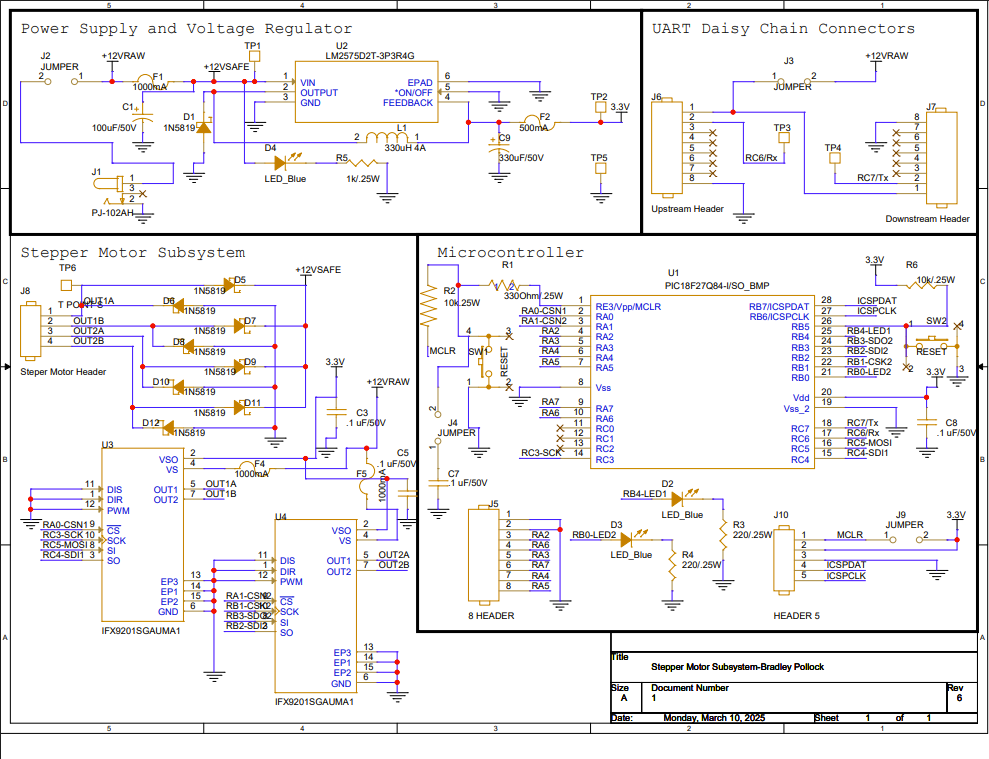
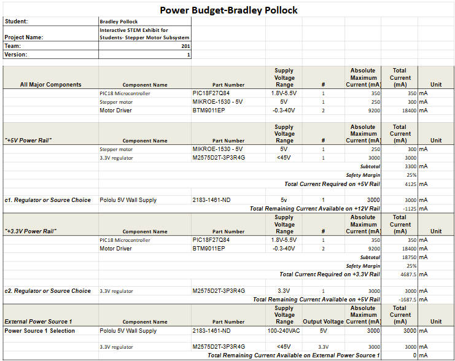

## Stepper Motor Subsystem Schematic
The following schematic was designed using Cadence Capture CIS. (Downloads Below)
>Feb 28th Update: Part Reference designators have been updated, power indicator LED has been added.

PDF available [*here*](BPollock_StepperSubsystem_Schematic_V7.pdf)
ZIP available [*here*](BPollock_Subsystem_4.16.2025.zip)

## Power Budget
Below is the power budget used to determine necessary supply voltages for the project. A PDF download is available [*here*](budget.pdf).

