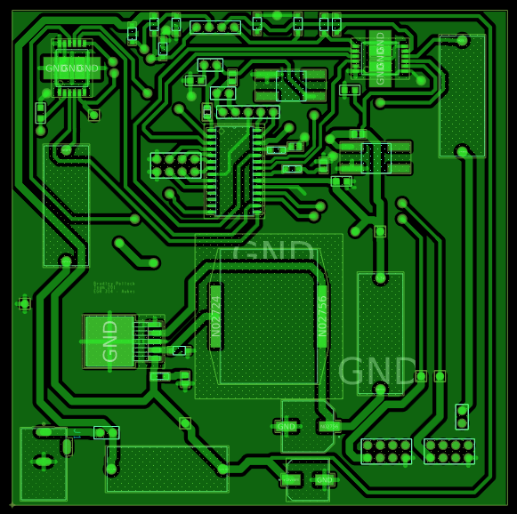
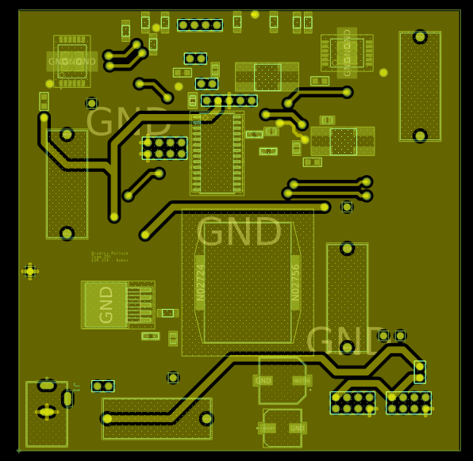
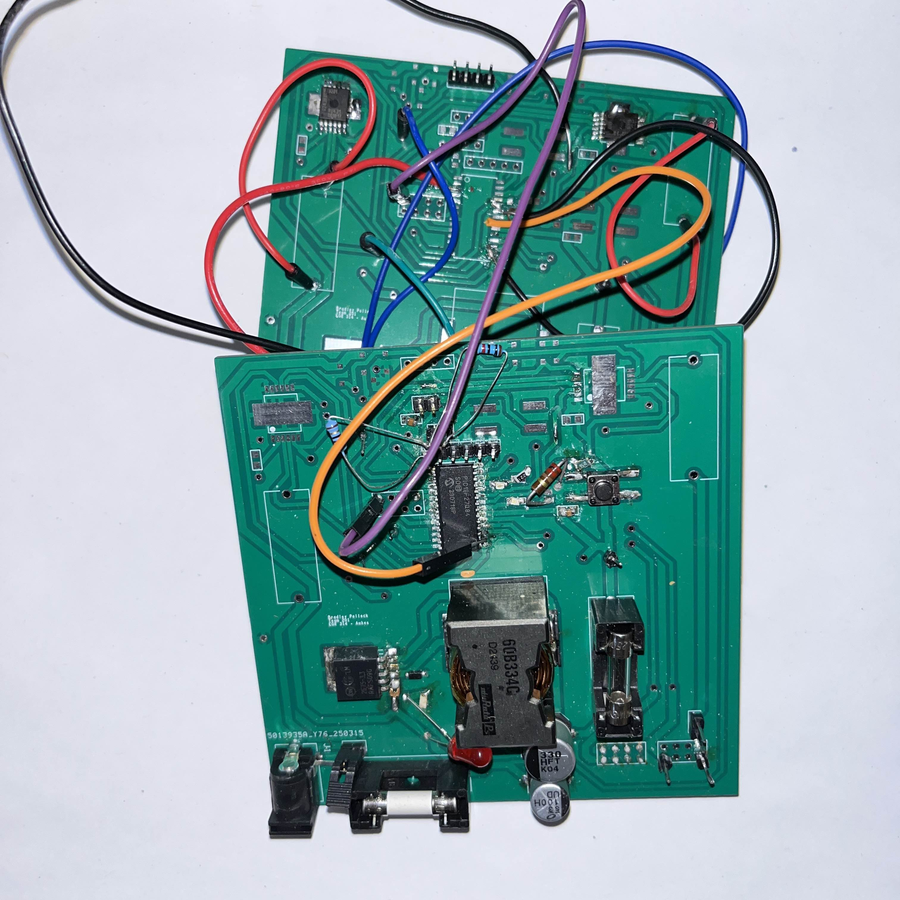
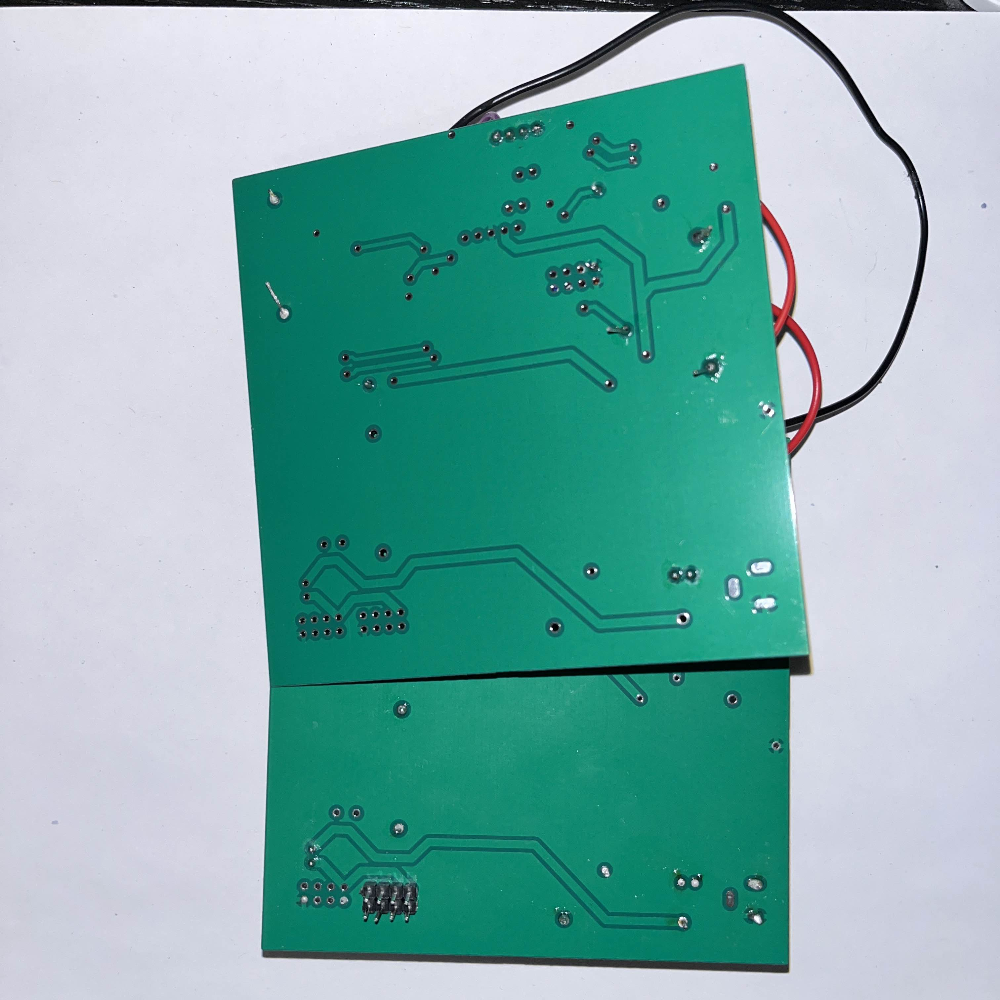

## **Introduction**
The following page documents the final schematic, PCB, and power budget for the stepper motor subsystem. The schematic, designed in Capture CIS, features each major functional unit of the device. The power budget can be found at the bottom of the page. The power budget can also be found on the [*Component selection Process*](https://bradpollock.github.io/Component-Selection/Component-Selection-Process/) page. For a complete bill of materials, please see [*Bill of Materials*](https://bradpollock.github.io/Bill-of-Materials/Bill-of-Materials/) above.

## **Stepper Motor Subsystem Schematic**
The following final schematic was designed using Cadence Capture CIS. (Downloads below) As of April 16, flyback protection diodes were added in an effort to mitigate the violent shorting seen from the chosen motor driver. The final product demonstrated at the May 05 Innovation Showcase featured two of the same board used. This decision was made in an effort to isolate the motor driver circuits and protect future microcontrollers from shorting damage.

>Design note: The current schematic design was implemented on the final project displayed at the May 02 Innovation Showcase, though it is somewhat problematic. Prior feedback given from external reviewers (such as the need for a pull-up resistor, ICSP header compatibility, proper voltage inputs for ICs and the voltage regulator, and the ensuring of pin states on certain SPI pins) was implemented and can be seen here or in the actual project folders (ZIP found below). One issue persists despite these changes and numerous attempted workarounds, mandating a seperate board be used at final project demonstration. When the VS and OUT1 pins of either motor driver are bridged by any means while the device is powered on, there is a catastrophic and irreversible short generated. This short was the cause of unusability for at least one microcontroller, and remains a reason for great concern. No root cause was found for the short, and as such the current workaround is the use of two seperate boards, allowing power to be isolated between the microcontroller and motor drivers. For an analysis of this issue, see the [*Reflections*](https://asu-egr314-2025-s-201.github.io/06-Reflection/) page of Team 201's product

Schematic Design:

PCB Design: Top Layer

PCB Design: Bottom Layer

PDF available [*here*](BPollock_StepperSubsystem_Schematic_V7.pdf)
ZIP available [*here*](BPollock_Subsystem_4.16.2025.zip)

## **Final Design:**
Below is an image of the final PCB design implemented and displayed during the May 02 Innovation Showcase at ASU Polytechnic Campus. Note that two identical boards are used, this was done in an effort to protect microchips from shorting damage.

Final PCB: Top

Final PCB: Bottom

Final Team PCB Design:

### **Discussion of functionality**

The stepper motor subsystem supports the user needs by providing enticing motion and making the user interaction both visible and enjoyable. The stepper motor subsystem's indexing function was developed by the team in relation to the final seven design criteria to provide a simple method of sorting selected elements and/or colors to teach users about chemistry basics.

### **Version 2.0**

If a second version of the board would be developed, a major change would be isolated power supplies to mitigate the issues discussed earlier. It is recommended that the power system is developed first so that shorts or power problems that may occur in further use are avoided. This practice is also crucial when using current-sensitive ICs and when on-board power is used to power other system components (whether on-board or on a teammate’s board).

## **Power Budget**
Below is the power budget used to determine necessary supply voltages for the project. A PDF download is available [*here*](PowerBudget.pdf), and a Microsoft Excel Sheet [*here*](PowerBudget.xlsx).

>Updates made: Changes made to the power budget were mostly clerical in nature (increasing resolution and replacing part numbers and values from various components changed as the project took its final form). One major change to note is an increase of the overall supply voltage from +5 volts DC to +12 V DC. This was done for two main reasons: project requirements dictate a supply within the 9-12V range, and the final motor selected requires 12 volts. In choosing minor components, an inductor used to service a 3.3V switching regulator was chosen based on a necessity of at least 3 amps of current. Further changes and research shows that this was unnecessary, but the choice has yet to prove problematic. An oscilloscope reading of the +3.3V line appears clean and safe.

