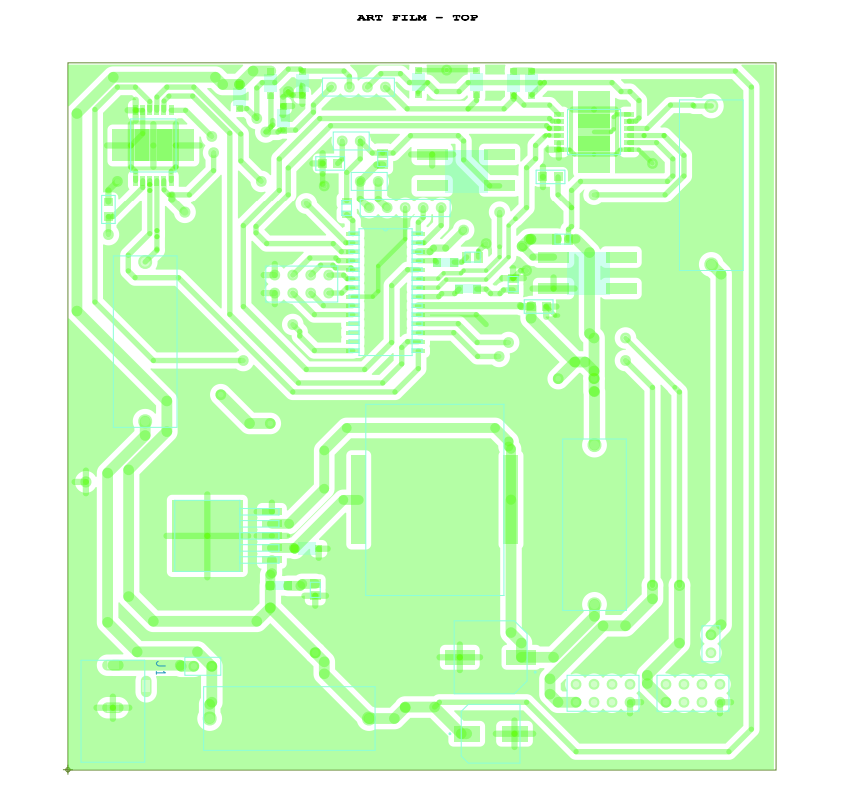
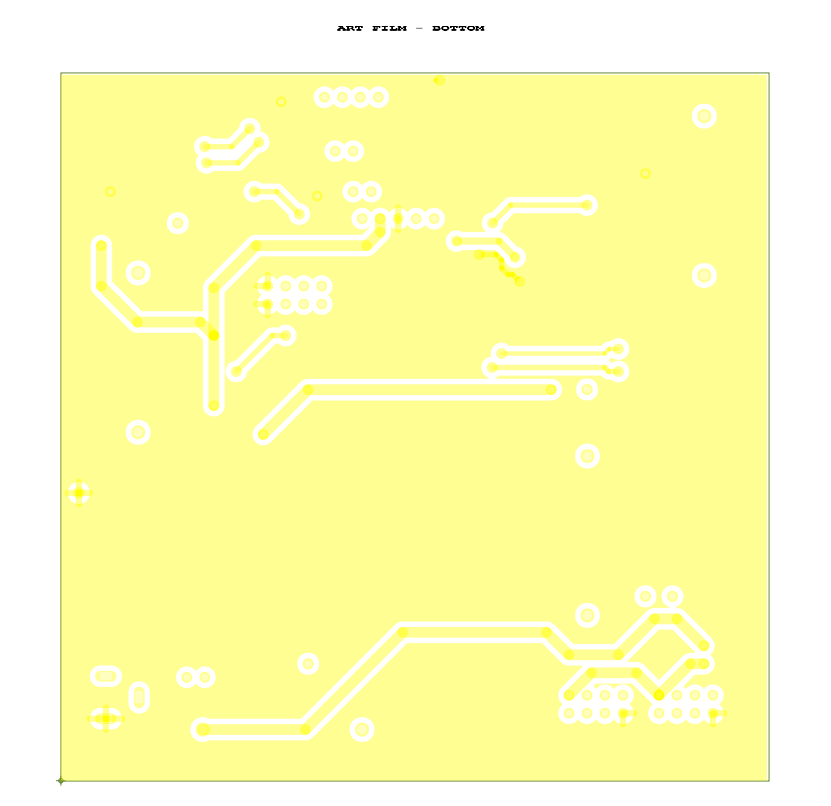
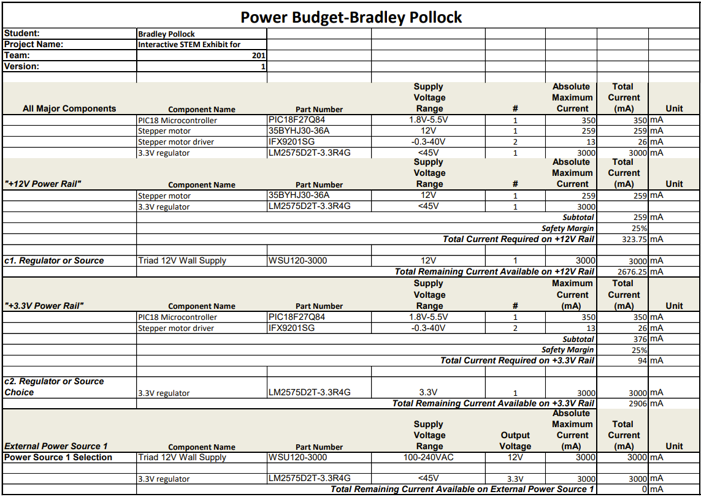

## **Introduction**
The following page documents the final schematic, PCB, and power budget for the stepper motor subsystem. The schematic, designed in Capture CIS, features each major functional unit of the device. The power budget can be found at the bottom of the page. The power budget can also be found on the [*Component selection Process*](https://bradpollock.github.io/Component-Selection/Component-Selection-Process/) page.

## **Stepper Motor Subsystem Schematic**
The following schematic was designed using Cadence Capture CIS. (Downloads below) As of April 16, flyback protection diodes were added in an effort to mitigate the violent shorting seen from the chosen motor driver. The final product demonstrated at the May 05 Innovation Showcase featured two of the same board used. This decision was made in an effort to isolate the motor driver circuits and protect future microcontrollers from shorting damage.

PDF available [*here*](BPollock_StepperSubsystem_Schematic_V7.pdf)
ZIP available [*here*](BPollock_Subsystem_4.16.2025.zip)

## **Power Budget**
Below is the power budget used to determine necessary supply voltages for the project. A PDF download is available [*here*](PowerBudget.pdf), and a Microsoft Excel Sheet [*here*](PowerBudget.xlsx).

>Updates made: Changes made to the power budget were mostly clerical in nature (increasing resolution and replacing part numbers and values from various components changed as the project took its final form). One major change to note is an increase of the overall supply voltage from +5 volts DC to +12 V DC. This was done for two main reasons: project requirements dictate a supply within the 9-12V range, and the final motor selected requires 12 volts. In choosing minor components, an inductor used to service a 3.3V switching regulator was chosen based on a necessity of at least 3 amps of current. Further changes and research shows that this was unnecessary, but the choice has yet to prove problematic. An oscilloscope reading of the +3.3V line appears clean and safe.

