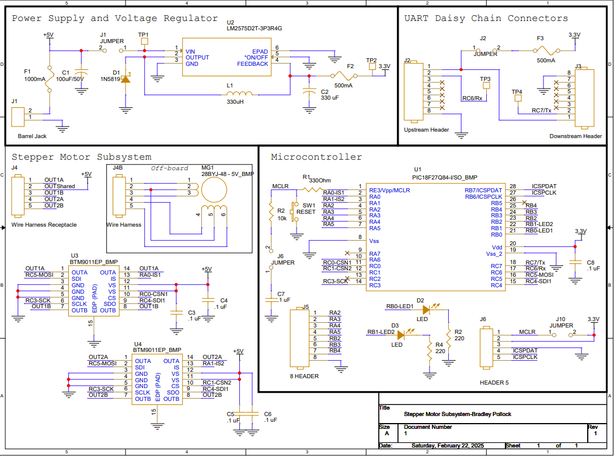

## Stepper Motor Subsystem Schematic
The following schematic was designed using Cadence Capture CIS. (Downloads Below)

PDF available [*here*](BPollock_StepperSubsystem_V2.pdf)
ZIP available [*here*](BPollock_Subsystem.zip)

## Power Budget
Below is the power budget used to determine necessary supply voltages for the project. A PDF download is available [*here*](budget.pdf).

